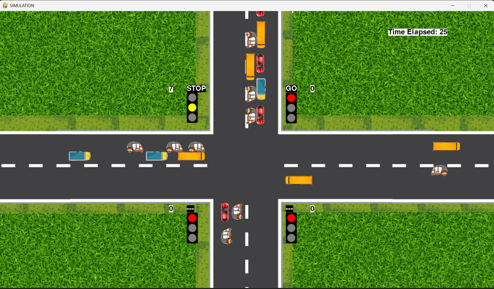
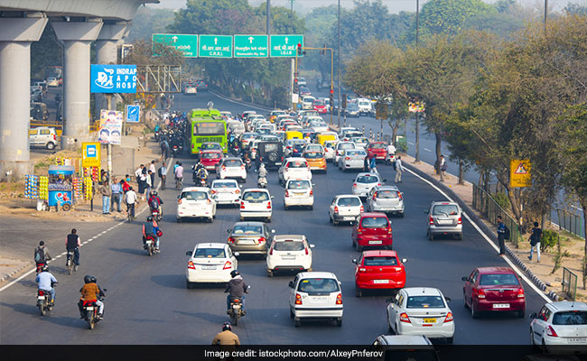
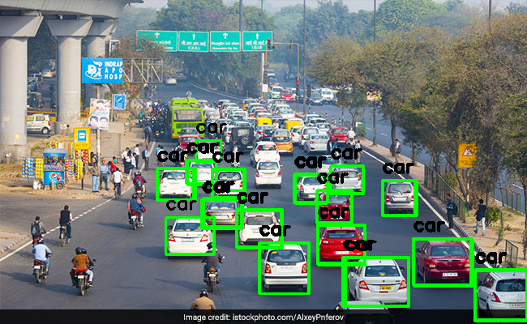

# 🍀 GUVI Hackathon

# 🚦 Traffic Management System

[](https://www.python.org/)  
[](https://www.pygame.org/news)  

A Python-based **traffic signal and vehicle simulation** using **Pygame**, simulating dynamic traffic signal control at a **four-way intersection** with multiple vehicle types.  

---

## 🌟 Project Overview

This project simulates a **realistic traffic intersection** where signals dynamically adapt to traffic conditions.  

**Vehicles simulated:**
- 🚗 Car  
- 🚌 Bus  
- 🚚 Truck  
- 🛺 Rickshaw  
- 🏍️ Bike  

The simulation includes:  
- Dynamic **signal timing** based on vehicle density  
- Lane-based vehicle **movement and turning**  
- **Signal visualization** (Green, Yellow, Red) with timers  
- Lane-wise **vehicle count tracking**  
- Traffic **throughput statistics**  

---

## 🗂️ Folder Structure

```

TRAFFIC-MANAGEMENT-SYSTEM/
│
├── images/                     # Images for simulation
│   ├── signals/                # Signal images
│   │   ├── red.png
│   │   ├── yellow.png
│   │   └── green.png
│   ├── mod_int.png             # Intersection background
│   ├── right/                  # Vehicles facing right
│   ├── left/                   # Vehicles facing left
│   ├── up/                     # Vehicles facing up
│   └── down/                   # Vehicles facing down
│
├── main_simulation.py          # Pygame-based simulation
├── traffic_controller.py       # Console-based signal controller
├── requirements.txt            # Python dependencies
└── README.md                   # Project documentation

````

---

## 🎮 Demo Simulation Screenshot

  

---

## 🔧 Simulation Features

- ✅ **Dynamic Traffic Signal Timing** – Green, yellow, and red durations adjust automatically.  
- ✅ **Vehicle Generation** – Randomized vehicles with lanes and turn behavior.  
- ✅ **Realistic Lane Behavior** – Vehicles maintain stopping gaps and follow lane rules.  
- ✅ **Signal Visualization** – Displays signal state and remaining time.  
- ✅ **Statistics Tracking** – Lane-wise vehicle counts, total vehicles passed, and vehicles per unit time.
  
---

## 🎮 Demo Vehicle Detection Screenshot

  
  

---

## ⚙️ Vehicle Detection Features

- Detects **cars, buses, and trucks** in images.
- Draws **bounding boxes** and labels on detected vehicles.
- Saves processed images in the `output_images` folder with sequential names.
- **Tkinter GUI** for navigating and viewing images.
- Compatible with **PNG images** in the `test_images` folder.

---

## 🏁 Installation

1. Clone the repository:

```bash
git clone https://github.com/cyancoder4066/TRAFFIC-MANAGEMENT-SYSTEM.git
cd TRAFFIC-MANAGEMENT-SYSTEM
````

2. Install dependencies:

```bash
pip install -r requirements.txt
```

> Python 3.8+ and Pygame 2.5.2 are required

---

## ▶️ How to Run

### **1. Graphical Pygame Simulation**

```bash
python simulation.py
```

* Vehicles move along lanes 🚗🚌🏍️
* Traffic signals update dynamically ⏱️
* Lane-wise vehicle counts are displayed 🧮
* Simulation runs for a fixed duration (default 300s, adjustable)

### **2. Vehicle Detection System**

```bash
python vehicle_detection.py
```
* A **Vehicle Detection** project using **YOLOv7** and **Python**, which detects vehicles (cars, buses, trucks) in images and saves the processed images with bounding boxes.
* The project also includes a **Tkinter GUI** for visualizing detections.

### **3. Console Signal Controller**

```bash
python Signal_time.py
```

* Input **vehicle count** in the console
* See updated **signal timings**

---

## ⏱️ Simulation Details

* **Signals:** 4 at the intersection

* **Vehicle Types:** Car, Bus, Truck, Rickshaw, Bike

* **Average Vehicle Passing Time:**

  * Car: 2s | Bike: 1s | Rickshaw: 2.25s | Bus: 2.5s | Truck: 2.5s

* **Dynamic Green Time Formula:**
  [
  GreenTime = \frac{(Cars \times carTime + Buses \times busTime + Trucks \times truckTime + Rickshaws \times rickshawTime + Bikes \times bikeTime)}{No. of Lanes + 1}
  ]

* **Threading** handles:

  * `simulationTime` – Tracks elapsed time
  * `initialize` – Sets up signals
  * `generateVehicles` – Continuously spawns vehicles 🚗
  * `setTime` – Updates green signal timings dynamically

---

## 📊 Statistics

* Lane-wise vehicle counts
* Total vehicles passed
* Vehicles per unit time (Traffic throughput)

> Displayed at the end of the simulation in the console.

---

## 🚀 Future Enhancements

* Integrate **YOLO-based vehicle detection** for real-time traffic input 🖥️
* Multiple intersections with **coordinated signals** 🌐
* Pedestrian crossings and lane changes 🚶‍♂️
* Optimize traffic for **high-density conditions** 🔧
* Enhanced GUI with interactive controls

---

## 🛠️ Dependencies

* pygame>=2.5.2
* tensorflow>=2.13.0
* opencv-python>=4.8.0
* numpy>=1.25.0
* matplotlib>=3.8.0
* Pillow>=10.0.0
